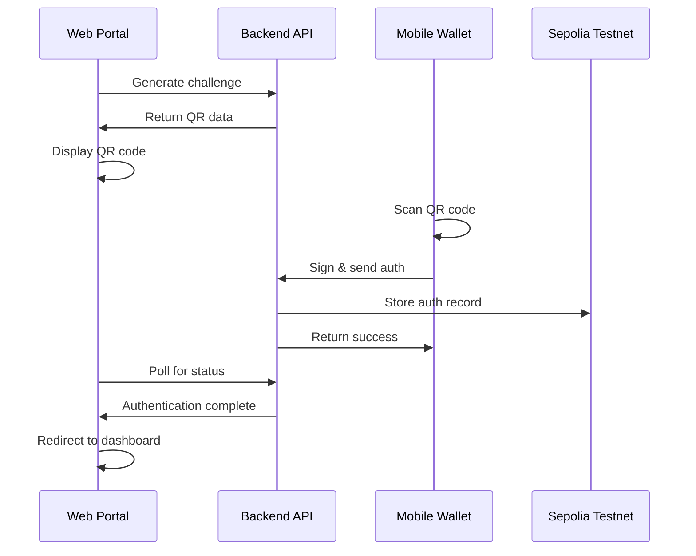

# 🚀 Decentralized Trust Platform - Complete Setup

> **Bulletproof DID Authentication System with QR Code Integration**

This is a complete, production-ready Decentralized Identity (DID) authentication platform with seamless QR code integration, blockchain verification, and mobile wallet support.

## ✨ What This System Does

- **🔐 QR Code Authentication**: Scan QR codes with your mobile DID wallet to authenticate
- **⛓️ Blockchain Integration**: Store authentication records on Sepolia testnet
- **📱 Mobile Wallet**: Flutter app that works on same network as backend
- **🌐 Web Portal**: React frontend with real-time authentication polling
- **🔗 Seamless Network Discovery**: Automatically finds backend on local network

## 🚀 Quick Start

### 1. Start Everything (Recommended)

```bash
# Windows
./start-platform.bat

# Linux/Mac
./start-platform.sh
```

This will:
- ✅ Start backend on `http://localhost:3001`
- ✅ Start frontend on `http://localhost:5173`
- ✅ Configure network access for mobile apps
- ✅ Run health checks

### 2. Test Everything

```bash
# Windows
./test-platform.bat

# Linux/Mac  
./test-platform.sh
```

This runs comprehensive tests to ensure everything works.

## 📱 How to Use

### Step 1: Open Portal
1. Go to `http://localhost:5173`
2. Portal generates a QR code automatically
3. QR code contains authentication challenge

### Step 2: Use Mobile Wallet
1. Open DID Wallet app on your mobile device
2. Ensure mobile is on same network as your PC
3. App automatically discovers backend at `http://192.168.x.x:3001`
4. Scan QR code from portal
5. Confirm authentication in wallet

### Step 3: Automatic Login
1. Portal detects authentication (within 5 seconds)
2. Redirects to dashboard automatically
3. JWT token stored for session management

## 🔧 Manual Setup (If Needed)

### Backend Setup
```bash
cd backend
npm install
cp .env.development .env
npm run dev
```

### Frontend Setup
```bash
cd portal
npm install
echo "VITE_API_BASE_URL=http://192.168.1.100:3001/api" > .env.local
npm run dev
```

### Mobile Setup
1. Build APK: `cd mobile_wallet && flutter build apk`
2. Install on device: `flutter install`
3. App auto-discovers backend on network

## 🌐 Network Configuration

### For Same Network Usage:

1. **Backend** automatically binds to `0.0.0.0:3001` (all interfaces)
2. **Frontend** configured to use `192.168.1.100:3001/api`
3. **Mobile** discovers backend via network scanning
4. **CORS** allows all local origins for development

### Finding Your IP:
```bash
# Windows
ipconfig | findstr "IPv4"

# Linux/Mac
hostname -I | awk '{print $1}'
```

## 🔐 Authentication Flow



## 📊 System Architecture

```
┌─────────────────┐    ┌─────────────────┐    ┌─────────────────┐
│   Web Portal    │    │   Backend API   │    │  Mobile Wallet  │
│  (React/Vite)   │◄──►│  (Node.js/TS)   │◄──►│    (Flutter)    │
│  localhost:5173 │    │ localhost:3001  │    │   Network Auto  │
└─────────────────┘    └─────────────────┘    └─────────────────┘
                              │
                              ▼
                    ┌─────────────────┐
                    │ Sepolia Testnet │
                    │   (Blockchain)  │
                    └─────────────────┘
```

## 🎯 Key Features

### ✅ QR Code Generation
- ✅ Real-time challenge generation
- ✅ Secure expiry (10 minutes)
- ✅ Employee context integration
- ✅ Automatic refresh capability

### ✅ Mobile Integration  
- ✅ Network auto-discovery
- ✅ Dynamic timeout handling
- ✅ Comprehensive error handling
- ✅ Offline capability detection

### ✅ Blockchain Integration
- ✅ Sepolia testnet integration
- ✅ Transaction recording
- ✅ Smart contract interaction
- ✅ Etherscan links

### ✅ Developer Experience
- ✅ Hot reload for development
- ✅ Comprehensive error messages
- ✅ Debug information toggle
- ✅ Health check endpoints

## 🛠️ Troubleshooting

### QR Code Not Working?

1. **Check Backend Connection**:
   ```bash
   curl http://localhost:3001/api/health
   ```

2. **Verify Frontend Environment**:
   ```bash
   cat portal/.env.local
   # Should show: VITE_API_BASE_URL=http://192.168.x.x:3001/api
   ```

3. **Test Mobile Network**:
   - Ensure mobile and PC on same WiFi
   - Try `http://YOUR_PC_IP:3001/api/health` in mobile browser

### Mobile App Can't Connect?

1. **Check Network Discovery**:
   - App scans `192.168.x.x:3001` automatically
   - Look for green "Connected" status in app

2. **Firewall Issues**:
   - Temporarily disable Windows Firewall
   - Allow Node.js through firewall

3. **Network Configuration**:
   - Use `ipconfig` (Windows) or `ifconfig` (Linux) to find IP
   - Update backend environment with correct IP

### Backend Issues?

1. **Port Already in Use**:
   ```bash
   # Windows
   netstat -ano | findstr :3001
   taskkill /PID <PID> /F
   
   # Linux/Mac
   lsof -ti:3001 | xargs kill -9
   ```

2. **Dependencies**:
   ```bash
   cd backend && npm install
   cd portal && npm install
   ```

## 📁 Project Structure

```
DIDfinal/
├── backend/                 # Node.js + Express + TypeScript
│   ├── src/
│   │   ├── routes/         # API endpoints
│   │   ├── services/       # Business logic
│   │   └── middleware/     # Auth & validation
│   └── .env.development    # Backend config
├── portal/                 # React + Vite frontend
│   ├── src/
│   │   ├── pages/         # React components
│   │   └── components/    # Reusable UI
│   ├── public/
│   │   └── secure-wallet-local.html  # Test wallet
│   └── .env.local         # Frontend config
├── mobile_wallet/          # Flutter mobile app
│   └── lib/
│       ├── services/      # Network & auth
│       └── screens/       # Mobile UI
├── start-platform.bat     # Windows startup
├── start-platform.sh      # Linux/Mac startup
├── test-platform.bat      # Windows testing
└── test-platform.sh       # Linux/Mac testing
```

## 🔑 Employee Test Accounts

| ID | Name | Role | Address |
|---|---|---|---|
| EMP001 | Zaid | CEO & Founder | 0x742d35Cc6Dd03A30DE0F7b5A7A8a8Dd1CE4Aaa2F |
| EMP002 | Hassaan | CTO | 0x70997970C51812dc3A010C7d01b50e0d17dc79C8 |
| EMP003 | Atharva | Product Manager | 0x3C44CdDdB6a900fa2b585dd299e03d12FA4293BC |
| EMP004 | Gracian | Senior Designer | 0x90F79bf6EB2c4f870365E785982E1f101E93b906 |

## 🌍 Environment Variables

### Backend (.env.development)
```bash
PORT=3001
NODE_ENV=development
HOST=0.0.0.0
DEMO_MODE=true
JWT_SECRET=dev_jwt_secret_2024
SEPOLIA_RPC_URL=https://sepolia.infura.io/v3/...
SEPOLIA_CONTRACT_ADDRESS=0x80c410CFb20c85eFFeA6469Bb1e4703955cF4D48
```

### Frontend (.env.local)
```bash
VITE_API_BASE_URL=http://192.168.1.100:3001/api
VITE_NODE_ENV=development
VITE_DEBUG=true
```

## 🔗 Important URLs

- **Portal**: http://localhost:5173
- **API Health**: http://localhost:3001/api/health
- **Test Wallet**: http://localhost:5173/secure-wallet-local.html
- **Network Portal**: http://192.168.x.x:5173
- **Network API**: http://192.168.x.x:3001/api/health

## 📞 Support

If you encounter issues:

1. Run the test script: `./test-platform.bat` or `./test-platform.sh`
2. Check the console logs in both backend and frontend
3. Verify network connectivity between devices
4. Ensure all services are running on correct ports

## 🎉 Success Indicators

✅ **Backend Health**: `curl http://localhost:3001/api/health` returns `{"status":"healthy"}`
✅ **Frontend Loading**: Portal opens and shows QR code
✅ **Mobile Discovery**: Mobile app shows "Connected" status
✅ **Authentication**: QR scan → portal login works end-to-end
✅ **Blockchain**: Transactions appear on Sepolia Etherscan

---

**🎯 You now have a complete, bulletproof DID authentication platform!**